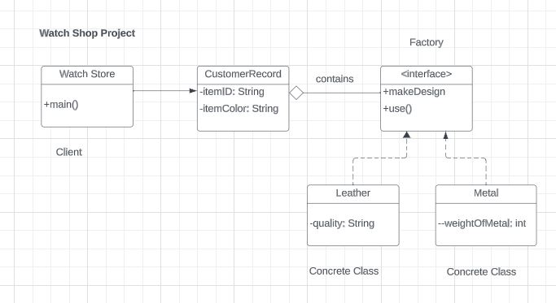

## Problem Scenario
Implement factory design pattern using Watch as the factory interface. The interface implements two methods: makeDEsign() and use().

Leather and Metal are concrete objects that implements Pet interface.

CustomerRecord holds attributes such as itemID, itemColor, and Watch.

Watch Shop would be the client object.

Refer to the UML Class Diagram

## UML Class Diagram

